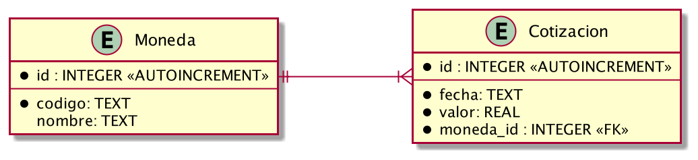
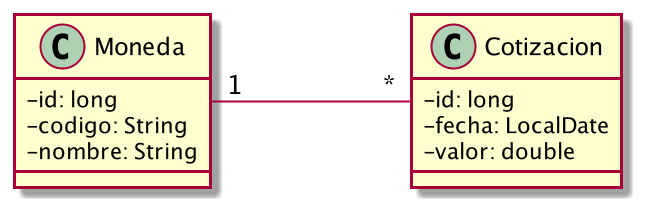
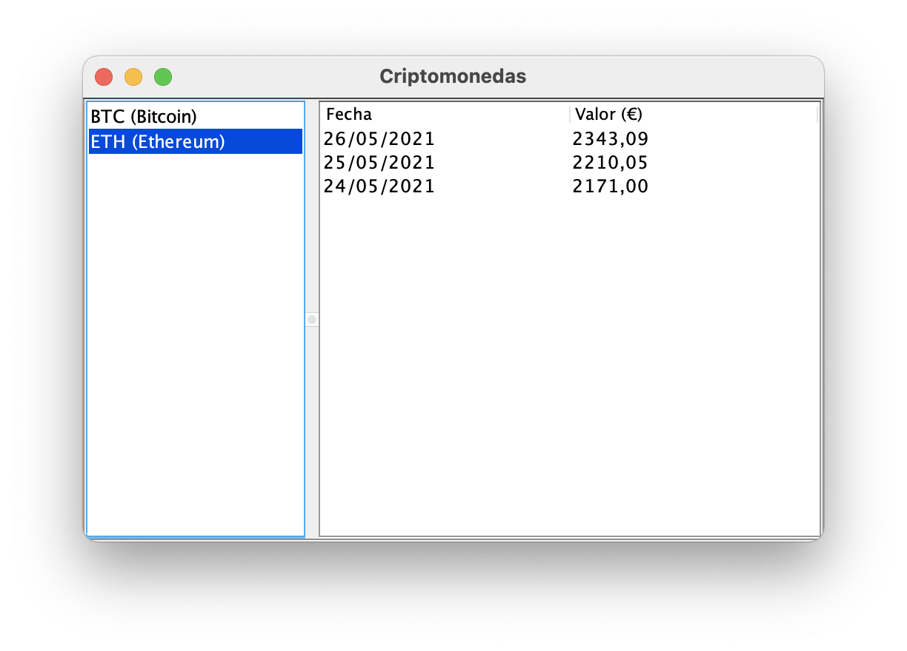
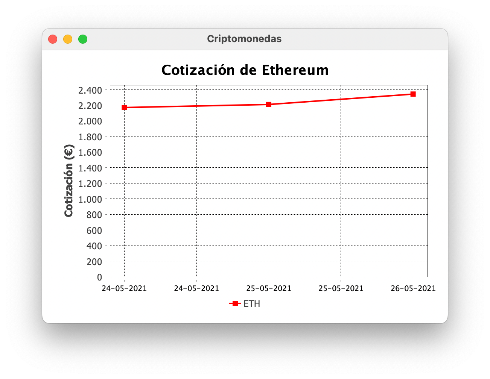

# Criptomonedas

Crea una aplicación que muestre las cotizaciones de las [criptomonedas](https://es.wikipedia.org/wiki/Criptomoneda)
almacenadas en la base de datos SQLite que [se adjunta con este proyecto](criptomonedas.db).

El diagrama con la estructura de la base de datos es:

El funcionamiento de la aplicación será así:

1. Al arrancar, el método `leerDatos()` de la clase `GestorBD` abrirá la base de datos, leerá su contenido y lo cargará
   en memoria, creando los objetos necesarios y vinculándolos entre sí, siguiendo este diagrama de clases:

2. Con los datos en memoria, se mostrará un interfaz de usuario como este, en el que al hacer click en cada criptomoneda
   se muestre la información correspondiente:

3. Cuando se seleccione una de las criptomonedas de la lista, se mostrará además un grafico como el que aparece en la
   captura:

## Restricciones

- Trabaja con las clases y métodos que ya hay en el proyecto; se pueden añadir métodos y propiedades, pero no modificar
  lo que ya existe.
- No se puede modificar el diseño de la ventana principal.
- Es obligatorio tratar las posibles excepciones de forma adecuada.

## Sugerencias

- En el fichero `pom.xml` ya se han añadido las librerías necesarias.
- Recuerda que para manipular la base de datos dispones de [DB Browser for SQLite](https://sqlitebrowser.org).
- Para crear el gráfico, usa la librería [JFreeChart](https://www.jfree.org/jfreechart/index.html); aquí
  tienes [un ejemplo](https://www.javaguides.net/2021/01/jfreechart-tutorial-create-charts-in-java.html) de cómo se
  utiliza y otro sobre [cómo trabajar con fechas](https://stackoverflow.com/a/5119422/14378620).
